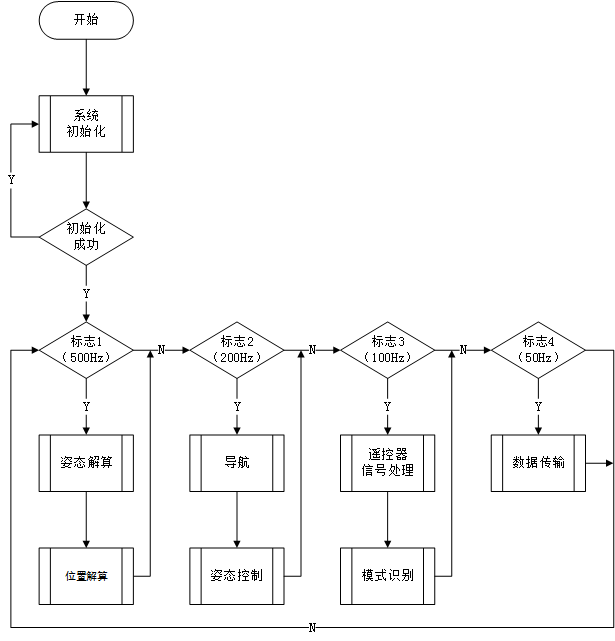

# 无人机飞控软件开发

## 1. 概述

### 1.1 飞行控制软件的目标环境
### 1.2 飞行控制软件的需求分析

1. 对无人机各状态量进行检测，包括位置、姿态、速度、角速度等等；
2. PWM捕获与输出；
3. 与地面控制站进行通信；
根据需求设计控制软件流程图如下：

### 1.3 飞行控制软件的总体方案

## 2. 驱动层开发

MPU9250学习资料：

https://github.com/Ruslan2288/STM32f4-MPU9250-BME280-PWM-control-pcb/blob/master/ROVmotorPcb/Src/MPU9250_I2C.c

### 2.2 读数
#### 2.2.1 温度

$$
T = \left(\dfrac{T_{\rm{out}}-T_{\rm{room}}}{S_T}\right)+21
$$

## 3. 服务层开发

## 4. 算法层开发

## 5. 功能层开发

